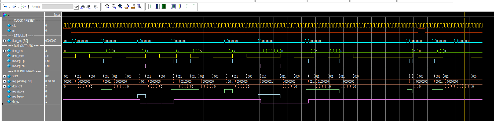
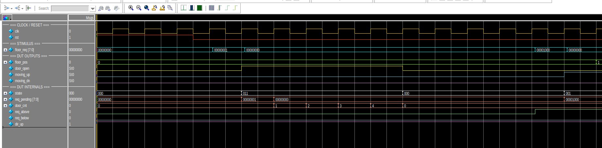
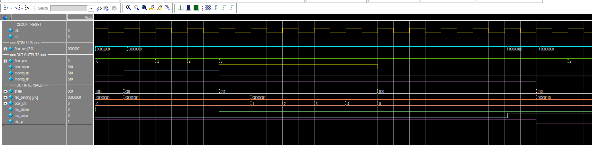
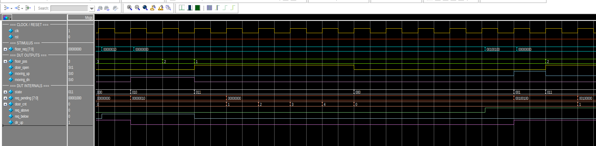
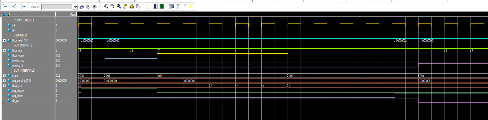
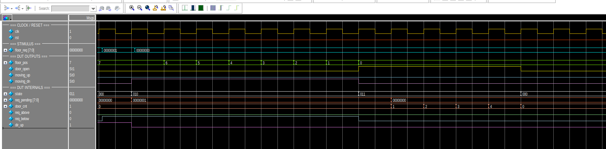
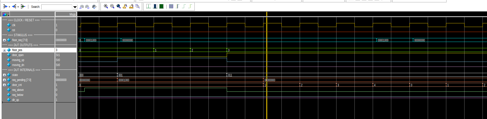
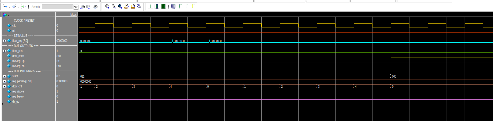
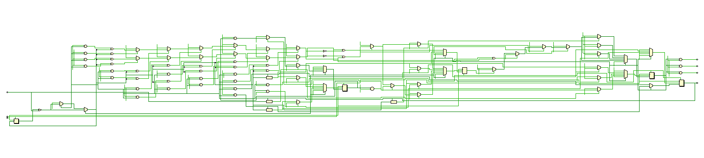

# Elevator Controller Project Report

## 1. Project Overview

This project implements a simple **elevator controller in Verilog RTL**. The design models a single elevator car serving multiple floors using a **finite state machine (FSM)** and a **SCAN-style scheduling policy**.

The controller accepts floor requests as a bitmask, stores pending requests internally, and decides whether to:

- stay idle,
- move upward,
- move downward, or
- open the door at the current floor.

The goal of the project is to demonstrate:

- RTL design using Verilog,
- FSM-based control logic,
- request storage and scheduling,
- self-checking simulation with a Verilog testbench, and
- waveform-based verification in ModelSim.

---

## 2. Design Description

### 2.1 Main Function

The module controls an elevator with these key behaviors:

- A floor request is given through `floor_req`, where each bit represents one floor.
- Requests are stored in an internal pending queue.
- The elevator moves **one floor per clock cycle**.
- When it reaches a requested floor, it opens the door.
- The door remains open for `DOOR_OPEN` clock cycles.
- If there are still requests in the current direction, the elevator continues in that direction before reversing.

This behavior matches the **SCAN (elevator) algorithm**, which reduces unnecessary direction changes and services queued requests in an ordered way.

### 2.2 FSM States

The controller uses four states:

| State | Meaning |
|---|---|
| `STATE_IDLE` | No movement, waiting for requests |
| `STATE_UP` | Elevator moves up one floor per clock |
| `STATE_DOWN` | Elevator moves down one floor per clock |
| `STATE_DOOR` | Door is open and the door timer is active |

### 2.3 Main Signals

| Signal | Direction | Description |
|---|---|---|
| `clk` | Input | System clock |
| `rst` | Input | Reset signal |
| `floor_req[FLOORS-1:0]` | Input | Floor request bitmask |
| `floor_pos` | Output | Current floor position |
| `door_open` | Output | High when the door is open |
| `moving_up` | Output | High while elevator moves upward |
| `moving_down` | Output | High while elevator moves downward |
| `req_pending_q` | Internal | Stored pending requests |
| `door_cnt_q` | Internal | Door open counter |
| `dir_up_q` | Internal | Remembers preferred direction |

---

## 3. Verification Method

The design is verified with a dedicated Verilog testbench. The testbench:

- generates a `10 ns` period clock,
- applies reset,
- sends floor requests,
- waits for the controller response,
- checks expected floor arrivals automatically, and
- prints pass/fail information during simulation.

Unlike a monitor-only testbench, this testbench includes **self-checking logic** through `check_floor(...)`, which reports an error if the elevator fails to reach the expected floor within a timeout.

---

## 4. Waveform Overview

The main ModelSim waveform contains the most important stimulus, outputs, and internal DUT signals:

- `clk`, `rst`
- `floor_req`
- `floor_pos`
- `door_open`
- `moving_up`, `moving_down`
- `state_q`
- `req_pending_q`
- `door_cnt_q`
- `req_above`, `req_below`
- `dir_up_q`

These signals allow verification of both the external behavior and the internal FSM decisions.

### How to read the waveform

- When `floor_req` goes high, a new request is applied.
- `req_pending_q` stores the request after the input pulse is removed.
- `floor_pos` changes by one floor each clock while moving.
- `moving_up` and `moving_down` indicate travel direction.
- `door_open` becomes high when the elevator stops at a requested floor.
- `door_cnt_q` shows how long the door remains open.
- `state_q` shows the FSM transition between idle, moving, and door-open states.

---

## 5. Waveform Analysis by Test Case

### Case 1 — Request at Current Floor

**Stimulus:** A request is issued for floor `0` while the elevator is already at floor `0`.

**Expected behavior:**

- `floor_pos` stays at `0`
- `moving_up = 0`, `moving_down = 0`
- `door_open` asserts immediately

**Observation:** The waveform shows no movement. The controller detects that the request matches the current floor and enters the door-open state directly.

---

### Case 2 — Upward Movement

**Stimulus:** A request is sent for floor `3`.

**Expected behavior:**

- the request is stored in `req_pending_q`
- `moving_up` becomes high
- `floor_pos` increments from `0` to `3`
- the door opens at floor `3`

**Observation:** The waveform confirms correct upward travel and proper door activation at the destination floor.

---

### Case 3 — Downward Movement

**Stimulus:** After reaching a higher floor, a request is issued for floor `1`.

**Expected behavior:**

- `moving_down` asserts
- `floor_pos` decrements one floor per cycle
- the door opens when floor `1` is reached

**Observation:** The waveform shows the controller switching direction correctly and serving the lower-floor request.

---

### Case 4 — Multiple Simultaneous Requests

**Stimulus:** Two requests are applied together: floors `2` and `5`.

**Expected behavior:**

- both bits are captured into `req_pending_q`
- the controller serves the requests in travel order
- the queue clears each served floor at door-open time

**Observation:** The waveform shows both requests stored and later removed one by one as the elevator reaches each requested floor.

---

### Case 5 — Full Travel to the Top Floor

**Stimulus:** A request is issued for the highest floor, floor `7`.

**Expected behavior:**

- continuous upward motion until the top floor is reached
- no premature direction reversal
- door opens at floor `7`

**Observation:** The waveform verifies long upward travel across the full range of floors.

---

### Case 6 — Full Travel Back to the Bottom Floor

**Stimulus:** From the top floor, a request is issued for floor `0`.

**Expected behavior:**

- `moving_down` stays active during the downward trip
- `floor_pos` returns step-by-step to `0`
- door opens at the bottom floor

**Observation:** The waveform confirms correct bottom-to-top symmetry in the movement logic.

---

### Case 7 — Requests on Both Sides While Moving

**Stimulus:** Requests exist both above and below the current floor during motion.

**Expected behavior:**

- the controller keeps its current direction first,
- serves requests in that direction,
- then reverses only when no more requests remain ahead.

**Observation:** This waveform demonstrates the intended SCAN behavior. Internal helper signals such as `req_above`, `req_below`, and `dir_up_q` explain why the controller keeps moving in one direction before reversing.

---

### Case 8 — Reset During Travel

**Stimulus:** Reset is asserted while the elevator is moving.

**Expected behavior:**

- FSM returns to `STATE_IDLE`
- `floor_pos` returns to `0`
- pending requests are cleared
- movement outputs deassert

**Observation:** The waveform shows that reset forces the controller back to its initial condition, confirming proper reset behavior.

---

### Case 9 — Door Reopen / Door Timer Restart

**Stimulus:** While the door is already open at a floor, the same floor is requested again.

**Expected behavior:**

- the door timer restarts,
- `door_open` stays asserted longer,
- the elevator does not move away early.

**Observation:** The waveform shows `door_cnt_q` restarting and the door-open interval extending, validating the door re-press logic.

---

## 6. RTL Schematic Reference

The synthesized RTL schematic is included as a structural reference.

---

## 7. Results and Conclusion

The simulation results show that the elevator controller works as intended for the tested scenarios.

Verified behaviors include:

- immediate service of a request at the current floor,
- correct upward and downward movement,
- handling of multiple pending requests,
- correct operation across the full floor range,
- proper SCAN-style direction handling,
- reliable reset recovery, and
- correct door reopen timing.

Overall, the project demonstrates a complete RTL workflow:

1. controller design in Verilog,
2. self-checking testbench development,
3. waveform inspection in ModelSim, and
4. functional validation through representative test cases.
